# Visualizations

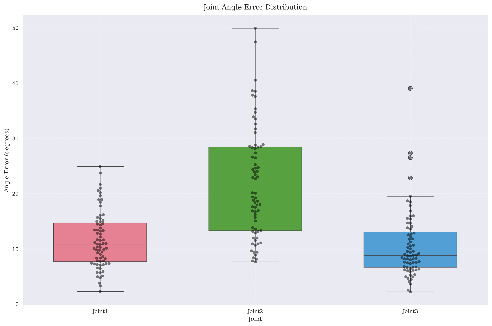
*Distribution of angle errors across all joints*

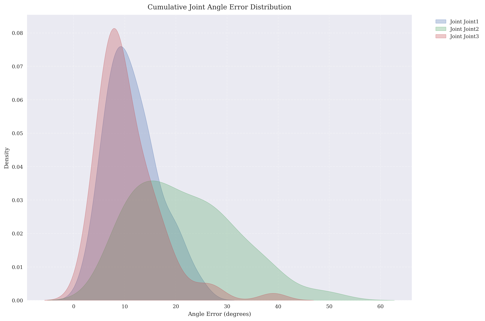
*Cumulative angle error progression over time*

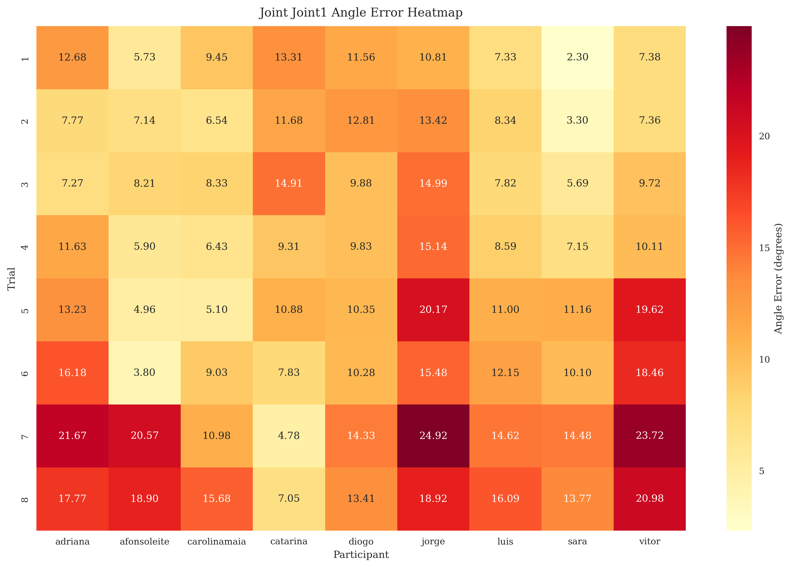
*Joint 1 error patterns across trials and participants*

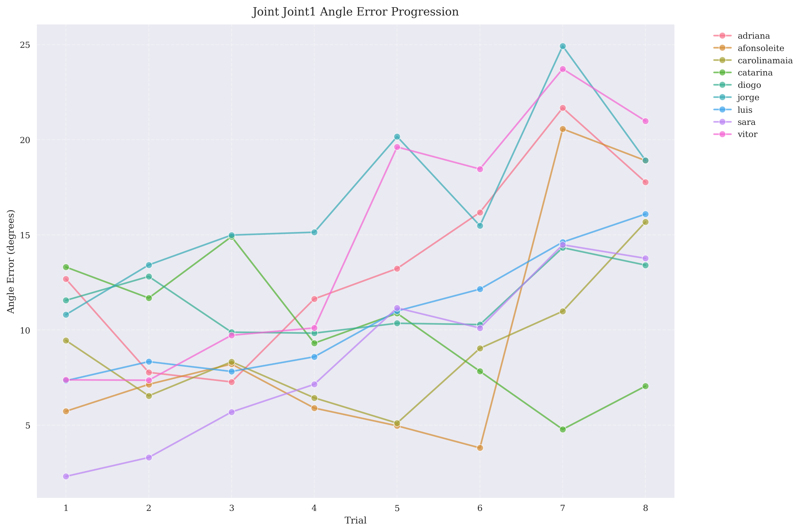
*Joint 1 error changes across trials*

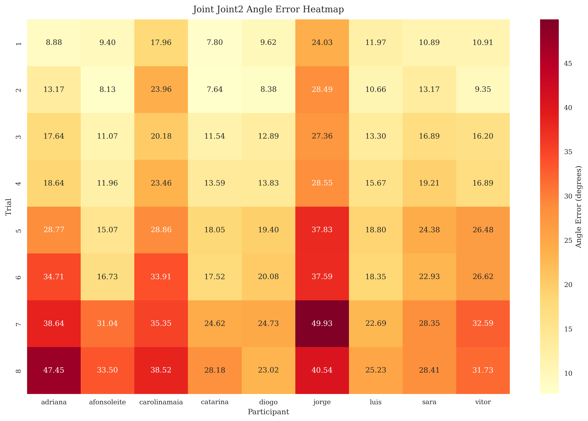
*Joint 2 error patterns across trials and participants*

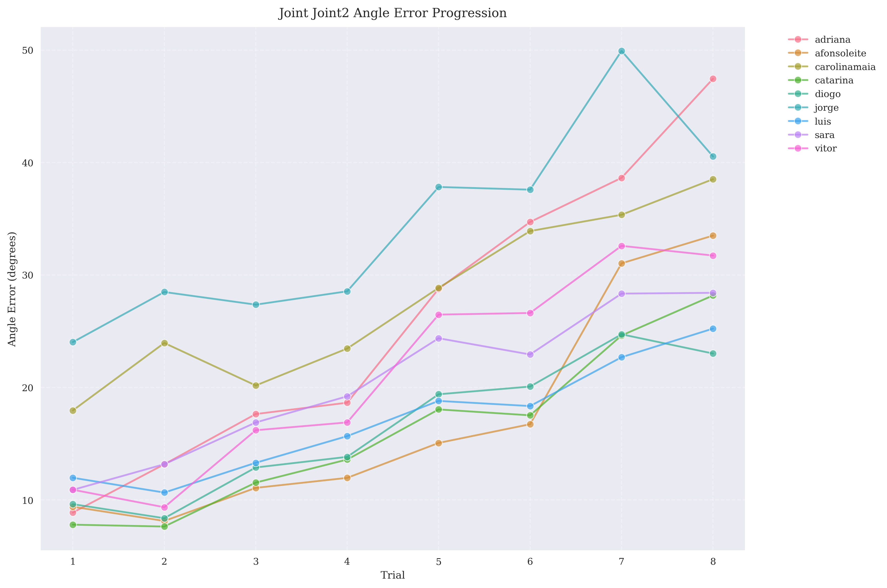
*Joint 2 error changes across trials*

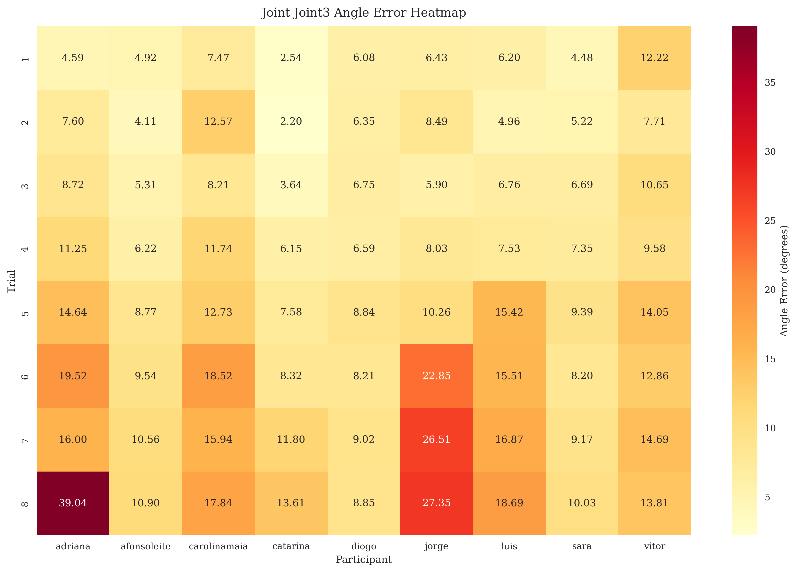
*Joint 3 error patterns across trials and participants*

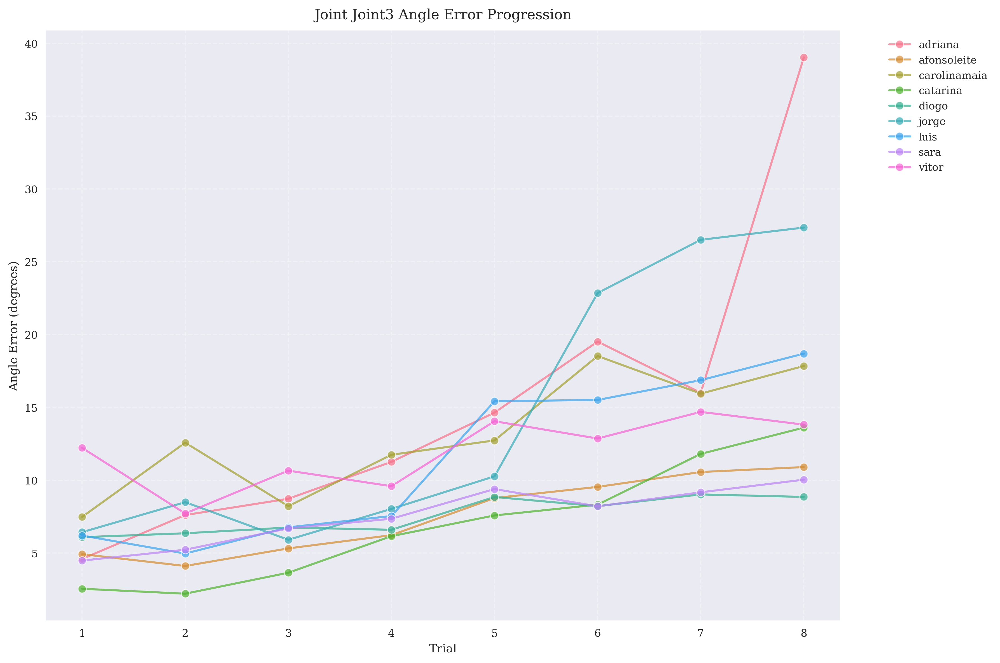
*Joint 3 error changes across trials*

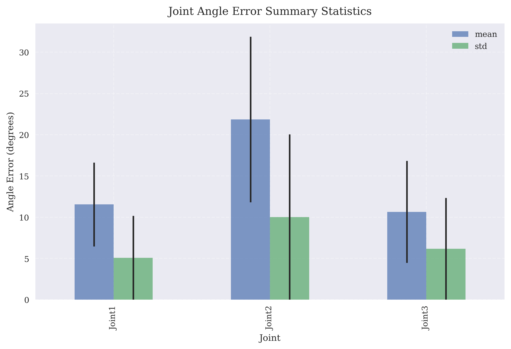
*Overall angle error summary for all joints*

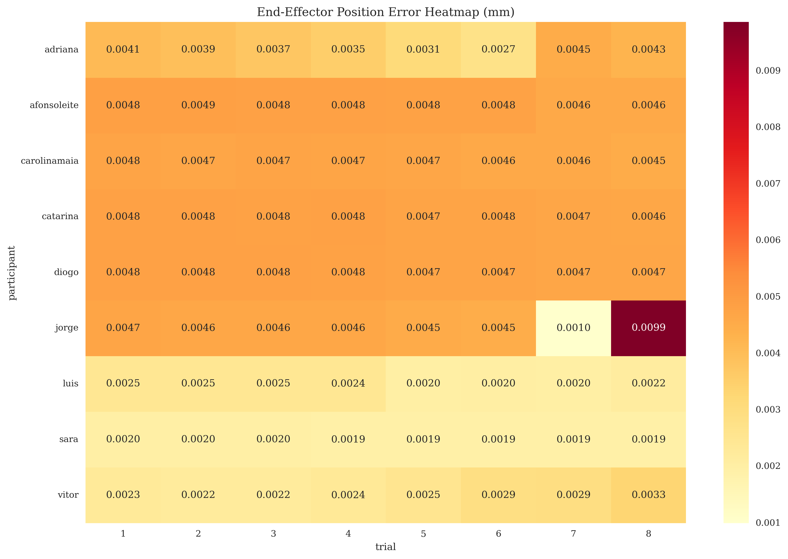
*End-effector position error patterns across trials*

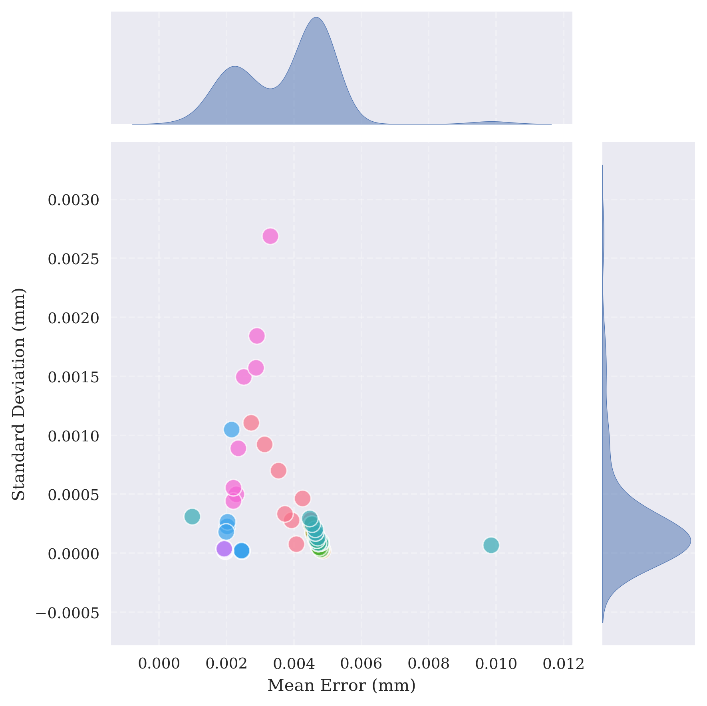
*Relationship between different position error metrics*

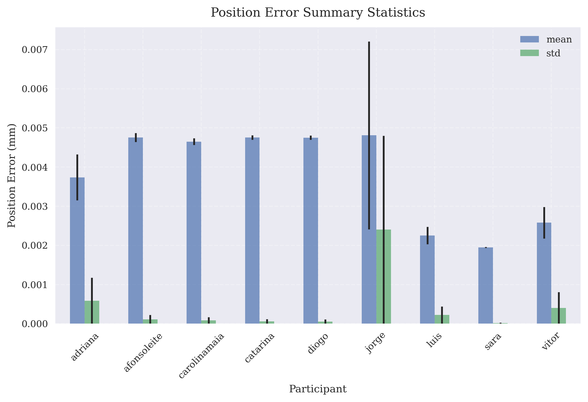
*Overall position error summary* 